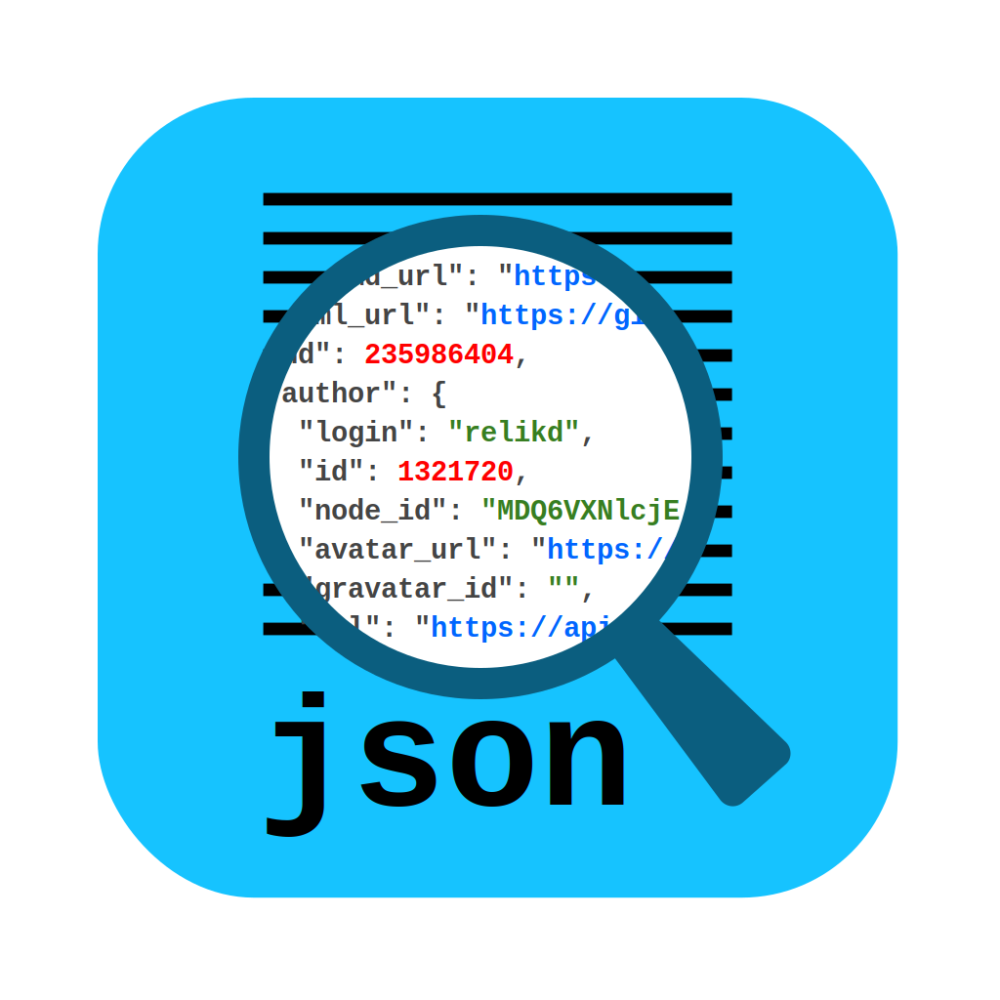
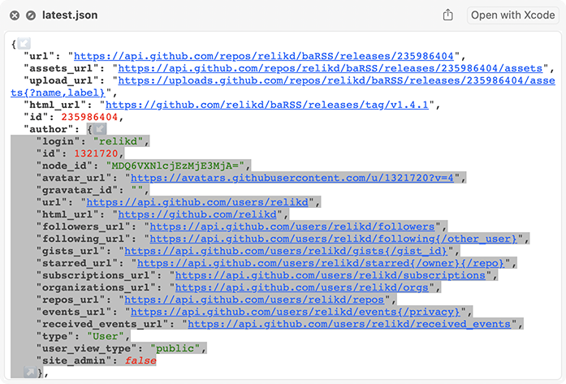

[](#)
[](https://github.com/relikd/QLJSON/releases/latest)
[](https://github.com/relikd/QLJSON/releases)




QLJSON
======

QuickLook plugin for `.json` files.



I have been using [QuicklookJSON](http://www.sagtau.com/quicklookjson.html) until recently but it has no support for macOS 15.
I copied some parts of [QuickJSON](https://github.com/johan/QuickJSON) but did through away almost everything.
The remaining code was heavily refactored.


Installation
------------

Requires macOS Catalina (10.15) or higher.

```sh
brew install --cask relikd/tap/qljson
xattr -d com.apple.quarantine /Applications/QLJSON.app
```

or download from [releases](https://github.com/relikd/QLJSON/releases/latest).


Features
--------

- No dependencies
- Small app size (2 MB)
- Dark Mode
- Foldable structures
- Auto-reload on file change (in App)
- Customizable html output

### How to customize CSS / JS

1. Right click on the app and select "Show Package Contents"
2. Open `Contents/Resources` and copy `style.css` (or `script.js`)
3. Open `~/Library/Containers/de.relikd.QLJSON.Preview/Data/Documents/`
4. Paste the previous file(s) and modify it to your liking (e.g. change text colors)

To modify the app preview, the procedure is mostly the same, except in step 3 the path is:
```
~/Library/Containers/de.relikd.QLJSON/Data/Documents/
```
